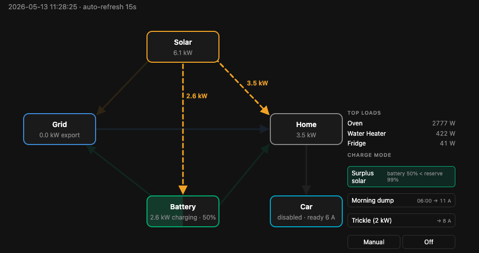
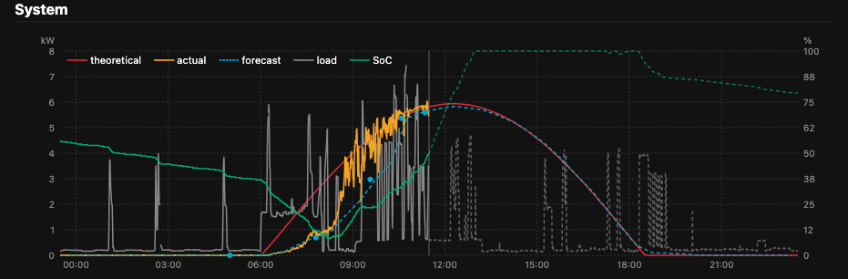
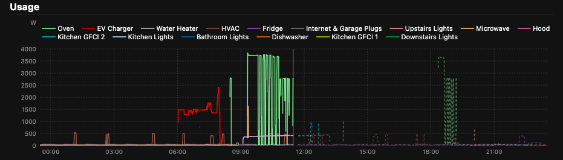

# energy_automation

Home energy automation for a Tesla Powerwall 3 + Emporia EV Charger Classic
site. Routes surplus solar PV to the EV based on a configurable priority
policy, with a browser dashboard for live state, history, and manual control.

The Python package is `elec_auto` (CLI: `elec-auto`); the GitHub repo was
renamed to `energy_automation` after the scope grew past EV charging alone.





## Dashboard

A FastAPI app served at `http://127.0.0.1:8000`. Three views:

- **Flow diagram** — live energy routing. Solar, Grid, Home, Battery, and Car
  nodes are connected by directed edges whose width and dashed-animation
  reflect the instantaneous kW. The right rail lists the top non-EV circuits
  drawing power and exposes the per-action enable toggles plus the
  automation kill switch.
- **System chart** — 24 h centered on now (12 h past, 12 h future).
  Theoretical PV (red clear-sky model), actual solar (orange), Solcast
  forecast (teal dashed), home load (grey), and battery SoC on the right axis
  (green). The future half is filled with the dashed load and SoC forecasts
  described below.
- **Usage chart** — per-circuit power on the same 24 h window. Solid traces
  are today's measurements from the Emporia Vue panel monitor; the future
  half shows yesterday's same-hour data as dashed "dumb forecast" curves so
  you can compare today's behavior against yesterday's at a glance.

Both charts use a 3-point centered moving average on the solar and load
traces to smooth the 30 s sample jitter; endpoints stay raw so the most
recent reading isn't lagged by an asymmetric window.

The page auto-refreshes every 15 s. Mode buttons POST back and use a PRG
redirect so reloads don't replay the action.

## Automation

A control loop runs every `poll_interval_sec` (default 30 s). Each tick:

1. Advances an immutable `State` — snapping to fresh Powerwall + Emporia
   telemetry, or dead-reckoning from the last reading when a source is
   stale (with explicit accounting for vampire load and EV-circuit draw).
2. Evaluates a roster of `Action` objects. Each action is a self-contained
   "here's when I fire and what amperage I want" unit with a priority, a
   `Settings`-enable flag, and an `applies(state, ctx)` prerequisite.
3. Filters to enabled + applicable actions, picks the highest priority,
   and pushes that amperage to the EVSE.

No FSM, no mode transitions, no persistent flags — every tick re-evaluates
from scratch. The bundled actions partition the situation space by
construction, so they don't fight:

- **Surplus** — EV pulls only what would otherwise export to grid. Gated
  by SoC ≥ `battery_reserve_pct` (default 80%) and "out of the morning
  dump window". Default priority for PV generation: home → battery → EV
  → grid.
- **Morning dump** — a scheduled window (default 05:00–08:00) that drains
  the battery down to `morning_dump_floor_pct` (default 10%) ahead of the
  day's PV peak, freeing headroom for the incoming generation. The dump
  amperage auto-converges on the floor as the window progresses, and on
  forecast-sunny days (`morning_dump_sunny_threshold_kwh`, default
  30 kWh) drops to the deeper `morning_dump_sunny_floor_pct` (default 5%).

The dashboard exposes per-action enable toggles (`surplus_enabled`,
`morning_dump_enabled`) plus a global **kill switch**. With the kill switch
engaged the controller still advances state (so telemetry stays current)
but skips action evaluation entirely — useful when you want to hand
control back to the EVSE app temporarily.

Deployment is a launchd user agent (`scripts/setup_macos.sh`) wrapped in
`caffeinate -i -s` plus `pmset disablesleep 1`, so a closed-lid MacBook
serves as the always-on host without going to sleep.

## Forecasting

Four sources feed the dashboard and the morning-dump sizing logic.

- **Theoretical PV** (`solar.py`) — clear-sky geometric model from panel
  azimuth/tilt and sun position (astral). The "perfect physics" benchmark
  against actual generation reveals cloud impact, soiling, or hardware
  degradation. Pre-deployment backfill via `elec-auto backfill`.
- **Solcast PV** (`solcast.py`) — hobbyist tier (10 calls/day). The
  `daily_schedule()` plan is one fetch at 05:00 + seven evenly spaced
  between sunrise and sunset, leaving two calls of budget for retries.
  Returns 72 h horizon at 30-minute periods, with p10/p50/p90 bands plus
  weather columns (cloud opacity, air temp). Consumed by `MorningDump` via
  `morning_dump_pv_credit_pct` (default 90%) when sizing the floor.
- **NWS weather** (`nws.py`) — US National Weather Service hourly forecast
  + ASOS observations (`KSFO` by default, ~8 mi from site). Free, no API
  key; provides sky cover and air-temp context to compare against Solcast.
- **Load + SoC** (`forecast.py`) — "yesterday repeats" heuristic for the
  dashboard's future-half traces:
  - `load_forecast(samples, start, end)` shifts yesterday's full-house load
    samples by +24 h. Skips nulls and negative-watt sensor noise.
  - `soc_forecast(...)` integrates `(PV − load)` forward from the most
    recent SoC reading in 5-minute steps. Charge power is clamped at
    `battery_max_charge_kw` (default 5 kW, one PW3 unit) so excess PV
    spills to grid in the model rather than overcharging the battery.

These heuristics are intentionally simple stubs — swap to a multi-day
average or a learned model without touching the chart, controller, or
action code.

## Hardware constraints

The site's wiring caps a few things that show up in defaults:

- Solar + battery → home is on a 65 A breaker (~52 A continuous), so the
  combined output rarely exceeds ~12 kW.
- The EV charger is on a 50 A circuit (40 A continuous), giving `EV_MAX_AMPS`
  its default of 40.
- One PW3 inverter is ~5 kW charge/discharge; `battery_max_charge_kw=5`.

## Layout

```
src/elec_auto/
├── config.py      # Pydantic settings loaded from .env
├── powerwall.py   # Tesla Powerwall 3 client (cloud Owner API or local TEDAPI)
├── emporia.py     # Emporia EV Charger Classic + Vue panel client (pyemvue)
├── solcast.py     # Solcast PV forecast client + daily schedule
├── nws.py         # NWS hourly forecast + ASOS observations client
├── solar.py       # Clear-sky theoretical PV model
├── forecast.py    # Load + SoC heuristic forecasters
├── policy.py      # decide_ev_amps()
├── state.py       # Immutable State: snap-to-measurement or dead-reckon
├── actions.py     # Action protocol + DEFAULT_ACTIONS (Surplus, MorningDump)
├── control.py     # Controller: advance state, evaluate actions, pick winner
├── timewindow.py  # Morning-dump window helpers
├── samples.py     # SQLite stores: samples, forecasts, loads
├── flow.py        # Power-flow decomposition (solar → grid/home/battery)
├── web.py         # FastAPI dashboard + control + forecast loops
└── cli.py         # elec-auto probe / serve / backfill
```

## Getting started

```bash
uv sync                         # install deps into .venv
cp .env.example .env            # fill in credentials + lat/lon
uv run elec-auto probe          # one-shot: print current state
uv run elec-auto serve          # foreground dashboard at :8000
```

## Deployment

Prototyped on a MacBook Pro, production target is a MacBook Air on the home
LAN. `uv sync` recreates the environment from the lockfile on either host.

```bash
bash scripts/setup_macos.sh     # one-shot launchd + pmset config
bash scripts/restart.sh         # restart the agent after code/env changes
```
